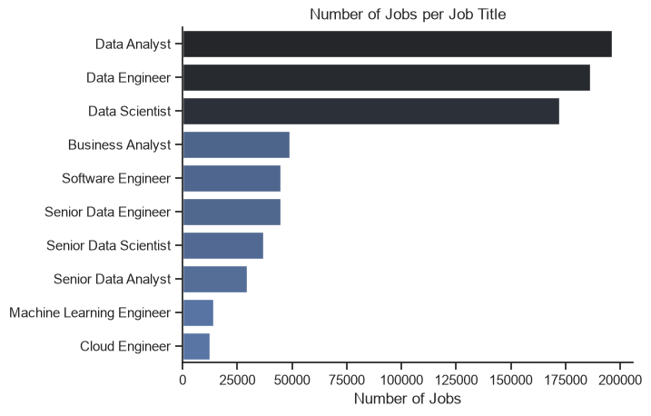
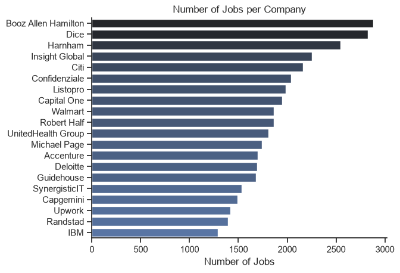
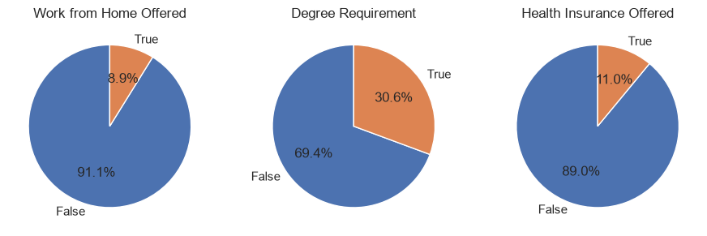
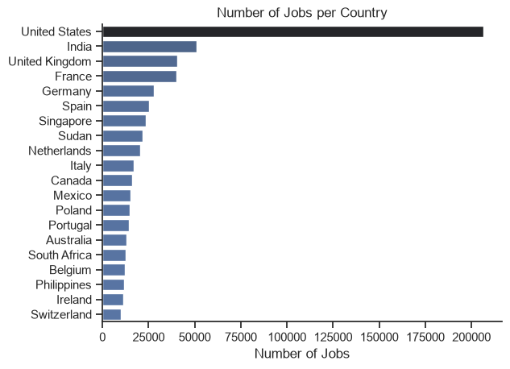
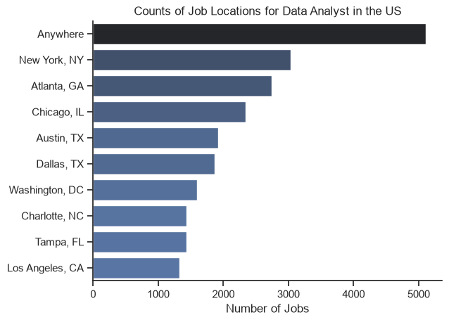
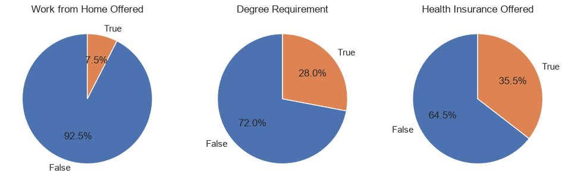
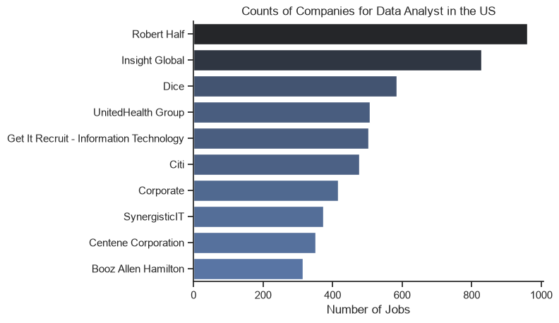
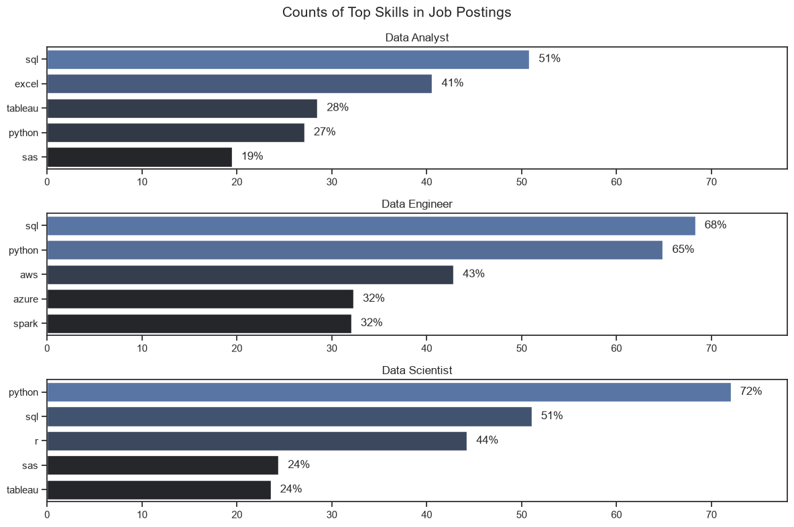
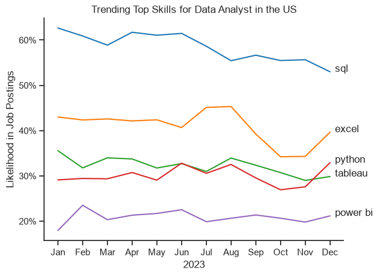

# 📊 Data Analyst Job Market Analysis

## Introduction
This project explores the global and regional job market for Data Analysts by combining **SQL** for relational database queries and **Python** for exploratory data analysis (EDA) and advanced tasks. The goal is to answer key questions about salaries, skill demand, and market trends.

The project is structured into two main parts:
* [`project_sql/`](./project_sql/) — Contains core SQL queries focusing on top-paying roles, skill demands, and optimal learning paths.
* [`project_python/`](./project_python/) — Contains Python scripts, exploratory data analysis, and ongoing analytical tasks.

---

## Questions I Wanted to Answer
* What are the top-paying Data Analyst jobs?
* What skills are required for these top-paying jobs?
* What skills are most in demand for Data Analysts?
* Which skills are associated with higher salaries?
* What are the most optimal skills to learn (high demand AND high paying)?

---

## Tools I Used
* **SQL & PostgreSQL** — for complex querying, multi-table joins, and database management.
* **Python, Pandas & NumPy** — for data cleaning, manipulation, and exploratory data analysis.
* **Matplotlib & Seaborn** — for generating clean visual insights and data distributions.
* **VS Code & Git/GitHub** — for development, version control, and portfolio sharing.

---

## Project Structure & Workflow

### Part 1: SQL Analysis ([`project_sql/`](./project_sql/))
* **Top-Paying Jobs** (Query 1)
* **Skills Required for Top-Paying Jobs** (Query 2)
* **Most In-Demand Skills** (Query 3)
* **Top-Paying Skills** (Query 4)
* **Most Optimal Skills to Learn** (Query 5)

### Part 2: Python Analysis & Additional Tasks ([`project_python/`](./project_python/))
* **Exploratory Data Analysis (EDA)** (`1_EDA_intro.ipynb`) — Initial data inspection, country/company distributions, and benefit offerings.

## The Analysis

<b>Click to expand SQL Analysis & Core Queries (1-5)</b>

### 1. Top Paying Jobs

To identify the highest-paying opportunities, I filtered remote (`Anywhere`) Data Analyst postings with a non-null salary and joined with `company_dim` to include the company name, sorting by `salary_year_avg` in descending order.

> **Key finding:** Salaries for the top 10 positions vary widely, from $184,000 to over $650,000 — showing that even within a single job title, compensation depends heavily on factors like seniority, company, and specialization.

### 2. Skills for Top Paying Jobs

To understand what skills are required for the highest-paying roles, I joined the top 10 highest-paying jobs (from the previous query) with the skills tables, using a CTE to keep the query readable.

> **Key finding:** SQL was the most frequently required skill among the top 10 highest-paying jobs, appearing in 8 out of 10 postings, followed closely by Python (7) and Tableau (6). This shows that even at the very top of the salary range, the same core skills from the broader "in-demand" list remain essential — high pay doesn't necessarily require exotic or niche skills.

### 3. In-Demand Skills

To find the most in-demand skills, I joined job postings with the skills tables and counted how many postings require each skill, grouping by skill and filtering for Data Analyst roles.

> **Key finding:** The top 5 most in-demand skills were SQL, Excel, Python, Tableau, and Power BI, with SQL appearing in 92,628 postings — over 25,000 more than the next closest skill (Excel). This highlights that querying ability remains by far the most consistently required skill across the Data Analyst job market, well ahead of visualization tools like Tableau and Power BI.

### 4. Top Paying Skills

To find which individual skills pay the most, I joined job postings with the skills tables and calculated the average salary per skill, filtered for remote Data Analyst roles with a specified salary.

> **Key finding:** The highest-paying skills were dominated by niche, specialized tools like PySpark, Bitbucket, and Couchbase — rather than the widely-used skills from the in-demand list (SQL, Excel, Python). This suggests these top results are likely driven by a small number of high-paying postings for specialized roles, rather than reflecting the broader market. This is exactly the kind of outlier effect that Query 5 addresses by filtering for skills with more than 10 postings.

### 5. Most Optimal Skills to Learn

Combining the demand data from Query 3 with the salary data from Query 4, I used two CTEs — `skills_demand` and `average_salary` — joined together to find skills that are both frequently requested and well-paid. I filtered to skills with more than 10 postings to avoid outliers skewing the results (e.g. a rare skill appearing in just one high-paying posting).

> **Key finding:** After filtering out low-demand outliers, the most optimal skills were Go, Confluence, Hadoop, Snowflake, and Azure — a noticeably different list from both the "in-demand" skills (SQL, Excel, Python) and the raw "top-paying" skills (PySpark, Bitbucket, Couchbase). This shows that the sweet spot between demand and salary favors specialized data engineering and cloud tools over both the most common tools and the rarest, highest-paying niche ones.

<b>Click to expand Bonus Practice Queries & Details</b>

## Bonus: Additional Practice Queries

Alongside the main 5 questions, I wrote a few extra queries to practice variations on the same concepts.

### Top Paying Jobs Without a Degree Requirement
Explores whether high salaries are achievable without a formal degree by filtering on `job_no_degree_mention`.

### Top Paying Jobs by Hourly Rate
Same approach as the main "Top Paying Jobs" query, but ranked by `salary_hour_avg` instead of annual salary — useful for contract/freelance roles.

### Most Optimal Skills (Alternative Approach)
As a variation on Query 5, I rewrote the same logic without CTEs — combining demand count and average salary in a single query, using a `HAVING` clause instead of a `WHERE` filter on a pre-aggregated CTE to exclude skills with 10 or fewer postings.

> **Key finding:** This version returns the exact same results as Query 5, demonstrating that the same analytical question can be answered with different SQL approaches — CTEs improve readability for multi-step logic, while a single aggregated query with `HAVING` can be more concise when the steps don't need to be reused separately.

### Do Top-Paying Skills Shift Month to Month?
Extending the top-paying skills analysis from Query 4, I broke the results down by posting month (January–March) to see whether the list of top-paying skills stays consistent over time.

> **Key finding:** Without a demand filter, the top-paying skills per month were dominated by niche outliers (dplyr, Bitbucket, Flask, Django) — the same small-sample effect seen in Query 4. Applying the same `demand_count > 10` filter used in Query 5 produced a more stable, realistic list (NoSQL, Hadoop, Jira), with Hadoop notably appearing in both this monthly breakdown and the overall Query 5 results — reinforcing it as a consistently valuable skill to learn, not just a one-off high-paying anomaly.

### Remote vs. On-site Salary Comparison

Using a `CASE` statement to categorize postings into "Remote" and "On-site" groups, I compared the number of postings and average salary between the two.

> **Key finding:** Remote postings pay slightly more on average ($94,770 vs. $93,765) — only about a 1% difference, which isn't meaningful in practice. The bigger story is the volume gap: on-site postings (4,859) vastly outnumber remote ones (604), roughly 8-to-1. This suggests remote flexibility doesn't come with a significant pay premium or penalty — it's simply a much smaller slice of the overall Data Analyst job market.

### Salary Distribution by Level

Using a `CASE` statement, I bucketed Data Analyst salaries into Entry, Mid, and Senior level brackets to see how postings are distributed across pay ranges, rather than looking at a single average.

> **Key finding:** Most postings fall into the Mid level bracket (2,773 postings, avg. $80,744), followed by Senior level (1,981 postings, avg. $127,400), with Entry level roles being the smallest group (709 postings, avg. $51,566). This suggests the Data Analyst job market skews toward candidates with some experience already — entry-level opportunities exist but make up a relatively small share (about 13%) of postings compared to mid and senior roles.

<b>Click to expand Python EDA & Visual Insights</b>

### Exploratory Data Analysis (EDA)

Before diving into specific questions, I explored the dataset overall — job title distribution, top countries and companies, and benefit offerings (remote work, degree requirements, health insurance) — both across all postings and narrowed down to Data Analyst roles in the United States.

See notebook here: [1_EDA_intro.ipynb](./project_python/1_EDA_intro.ipynb)

> **Key insight:**  Data Analyst, Data Engineer, and Data Scientist dominate the dataset (roughly 170,000-195,000 postings each), far ahead of Business Analyst or Software Engineer (~45,000 each) — confirming this dataset is well-suited for comparing these three core data roles.

> **Key insight:**  Booz Allen Hamilton, Dice, and Harnham post the most jobs overall (2,500-2,900 each), with a mix of staffing agencies (Dice, Insight Global) and consulting/government contractors (Booz Allen Hamilton, Accenture, Deloitte) among the top employers.

> **Key insight:**  Across all job postings, only 8.9% offer remote work and 11.0% offer health insurance, while 30.6% explicitly mention no degree requirement — showing that remote flexibility and health benefits are the exception, not the norm, across the broader data job market.

> **Key insight:**  The United States dominates the data job market with over 200,000 postings—more than four times the volume of the next highest country, India—while European and global tech hubs like the UK, France, and Germany follow closely behind, highlighting a heavily US-centric distribution in global data opportunities.

---

### Focused Analysis: Data Analyst Roles in the United States
Narrowing the analysis to Data Analyst postings in the US specifically:

> **Key insight:**  "Anywhere" (remote) is by far the most common location for US Data Analyst postings (~5,100), nearly double the next closest city, New York (~3,000) — remote work is clearly a major factor specifically within this role, even though it's rare across the dataset as a whole.

> **Key insight:**  Compared to the overall dataset, Data Analyst roles in the US offer meaningfully better benefits: 35.5% offer health insurance (vs. 11.0% overall) and 28.0% have no degree requirement — though remote work remains rare at just 7.5%, even slightly lower than the dataset-wide average.

> **Key insight:**  Robert Half and Insight Global — both staffing/recruiting agencies — post by far the most Data Analyst jobs in the US (~960 and ~830 respectively), suggesting a large share of these roles are filled through recruiting firms rather than direct company postings.

---

### Skill Demand Across Data Roles in the US

To understand which skills dominate the job market across different career paths, I analyzed job postings in the United States to calculate the percentage of postings requiring specific technical skills for **Data Analyst**, **Data Engineer**, and **Data Scientist** roles.

See notebook here: [`2_Skill_Demand.ipynb`](./project_python/2_Skill_Demand.ipynb)

> **Key insight:** 
> * **Data Analyst:** **SQL** leads with **51%** market demand, closely followed by **Excel** (41%), while **Tableau** (28%) and **Python** (27%) form the core secondary toolset.
> * **Data Engineer:** Heavily shifts towards infrastructure and programming, with **SQL** (68%)and **Python** (65%) dominating, supported by cloud platforms like **AWS** (43%).
> * **Data Scientist:** Centered around **Python** (72%), followed by **SQL** (51%) and statistical languages like **R** (44%).

### Skill Trends Over Time (US Data Analyst Roles)

To understand whether the demand for top skills shifts month-to-month, I analyzed job postings throughout the year to track the percentage of postings requiring specific technical skills over time for **Data Analyst** positions in the United States.

See notebook here: [`3_Skill_Trends.ipynb`](./project_python/3_Skill_Trend.ipynb)

> **Key insight:** 
> * **SQL Leadership:** **SQL** remains the undisputed leader, consistently holding over 50% market demand all year — starting strong at ~63% in January and closing at ~53% in December.
> * **Excel Fluctuations:** **Excel** maintains second place, generally hovering between 40% and 45%, though it dips to a low of ~34% in October and November before recovering to ~40% in December.
> * **Core Toolset Stability:** **Python**, **Tableau**, and **Power BI** form a steady secondary tier, with Python and Tableau intersecting around 32-33% in June, while Power BI maintains a consistent baseline around 20% throughout the year.

## What I Learned

Throughout this project, I strengthened my SQL skills in several key areas:

- **Complex query building:** Constructing multi-step queries using **CTEs** (`WITH` clauses) to break down complex problems into readable, logical steps — especially useful when combining results from multiple aggregations (Query 5).
- **Joins:** Combining data across multiple related tables (`job_postings_fact`, `company_dim`, `skills_dim`, `skills_job_dim`) using `LEFT JOIN` and `INNER JOIN` to bring together job details, company names, and required skills.
- **Aggregation:** Using `GROUP BY`, `COUNT()`, and `AVG()` to summarize data — for example, counting how many postings require each skill, and calculating average salaries per skill.
- **Query alternatives:** Learning that the same analytical question can often be solved multiple ways (e.g. CTEs vs. a single query with `HAVING`), and that the right choice depends on readability and reusability, not just correctness.
- **Filtering out noise:** Recognizing that raw rankings (like "top-paying skills") can be misleading due to small sample sizes, and using thresholds (`demand_count > 10`) to surface more reliable insights.
- **Data analysis with Python:** Using Pandas for inspecting datasets, cleaning dataframes, and leveraging Seaborn/Matplotlib to build distribution plots and uncover hidden market insights.

## Conclusions

This analysis revealed that the "best" skill to learn depends entirely on what you're optimizing for:

- **In-demand skills** (SQL, Excel, Python, Tableau, Power BI) are the safest bet — they appear across the widest range of job postings.
- **Top-paying skills** (PySpark, Bitbucket, Couchbase) pay the most on average, but are tied to a small, niche subset of highly specialized roles.
- **Most optimal skills** (Go, Confluence, Hadoop, Snowflake, Azure) strike a balance — well-paid *and* requested often enough to be a realistic, strategic learning target.

For someone starting out, the in-demand skills remain the essential foundation. But for someone looking to stand out and increase earning potential, the "most optimal" list points toward cloud and data engineering adjacent tools as a strong next step beyond the basics.